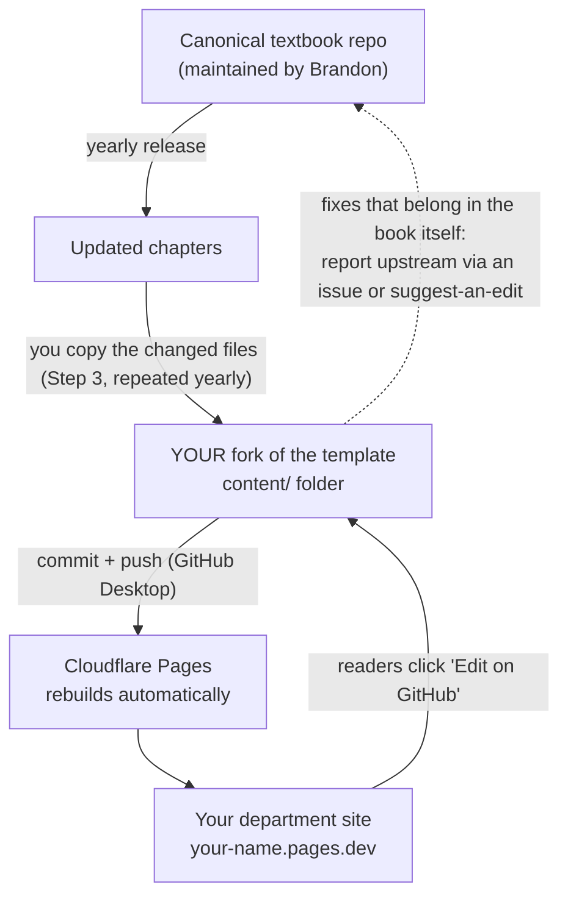

# Setting Up Your Department Edition

**A guide for course coordinators**

This guide walks you through creating your own department edition of the textbook: a copy of the chapters you choose, on your own web address, with its own annotation space for your students. You do everything through websites and one free desktop app. **You never need to type commands into a terminal.** If a tutorial elsewhere tells you to, stop and check with the maintainer first.

Budget an afternoon (2–3 hours) the first time. Yearly updates after that take under an hour.

You can preview what a fresh, unmodified edition looks like here: **https://textbook-edition-template.pages.dev**

---

## The one idea to hold onto: there are TWO repositories

A *repository* (repo) is a project folder hosted on GitHub. This setup involves two of them, and they play very different roles:

| | The textbook | The site template |
|---|---|---|
| **Address** | `github.com/textbookproject2026-alt/textbook` | `github.com/textbookproject2026-alt/textbook-edition-template` |
| **What it is** | The book itself — every chapter, figure, and reference, maintained by the textbook maintainer (currently Brandon) | The website machinery that turns markdown chapters into a readable site |
| **What you do with it** | **Copy from it.** You take the chapters you want. You never edit this repo directly. | **Fork it.** Your fork becomes *your* repo, *your* site. This is where all your work happens. |

Think of the textbook repo as the manuscript and the template repo as the printing press. You take your own copy of the press, feed it the pages you want, and adjust the examples for your own course.

Here is how content flows through the system, including the yearly update cycle:



Read it top to bottom: the book updates yearly → you copy the changes into your fork → Cloudflare rebuilds your site. Edits suggested by *your* readers land in *your* fork. Anything that should improve the book for everyone gets reported back to the canonical repo — see "Improving the textbook itself" near the end.

---

## Before you start

You need, in this order:

1. **A free GitHub account** — sign up at https://github.com
2. **GitHub Desktop** installed — free download at https://desktop.github.com (this is the one desktop app; it moves files between your computer and GitHub with buttons instead of commands)
3. **A free Cloudflare account** — sign up at https://dash.cloudflare.com/sign-up (this hosts your site, at no cost)
4. **A free Hypothes.is account** — sign up at https://hypothes.is (this powers the annotation sidebar)
5. **Your analytics line from the maintainer** — email the maintainer the web address you plan to use (you'll choose it in Step 6; something like `bio-edition-2027.pages.dev`). They will register it and send back a single line of text you'll paste in Step 7. You can request this at any point before Step 7.
6. *(Optional)* **Obsidian** — free at https://obsidian.md. A pleasant editor for the chapters. Any text editor works; Obsidian just shows links and formatting nicely.

---

## Step 1 — Fork the template (~5 min)

"Forking" creates your own copy of the template repo under your GitHub account. Your fork is fully yours: you can edit it without affecting anyone else.

1. Log in to GitHub, then open `github.com/textbookproject2026-alt/textbook-edition-template`.
2. Click the **Fork** button, top right.

   [SCREENSHOT: template repo page with the Fork button highlighted, top right]

3. On the "Create a new fork" page:
   - **Owner:** your account.
   - **Repository name:** pick something that identifies your edition, e.g. `textbook-bio-edition`. Write this name down — you'll type it again in Step 7.
   - Leave everything else as it is.
4. Click **Create fork**.

You land on your copy: `github.com/YOUR-USERNAME/textbook-bio-edition`. Bookmark it.

---

## Step 2 — Clone your fork with GitHub Desktop (~10 min)

"Cloning" downloads your fork to your computer so you can add and edit files. GitHub Desktop then syncs your changes back up with one button.

1. Open GitHub Desktop and sign in with your GitHub account (**File → Options → Accounts** on Windows, **GitHub Desktop → Settings → Accounts** on Mac).
2. **File → Clone repository…**
3. Your fork appears in the list under your username. Select it.
4. Note the **Local path** (where the folder will live on your computer — the default is fine), then click **Clone**.

   [SCREENSHOT: GitHub Desktop clone dialog with the fork selected and the Local path field visible]

You now have the repo as a normal folder on your computer. **Show in Explorer / Reveal in Finder** (in the Repository menu) opens it. Inside you'll see a `content` folder (nearly empty — that's expected), a `quartz` folder (the machinery — never touch it), and a file called `quartz.config.yaml` (you'll edit exactly three lines of it in Step 7 — nothing else, ever).

---

## Step 3 — Add the textbook content (~20 min)

Now you fill the empty `content` folder with the chapters you want, copied from the canonical textbook.

1. In your web browser, open `github.com/textbookproject2026-alt/textbook`.
2. Click the green **Code** button, then **Download ZIP**.

   [SCREENSHOT: canonical textbook repo with the green Code button open and Download ZIP highlighted]

3. Unzip the download. Inside you'll find the book's folders, including `chapters` and `assets`.
4. Using your normal file manager (Explorer / Finder), copy into your fork's `content` folder:
   - the **`chapters` folder** — copy the whole folder, then delete the chapter files you *don't* want from your copy. Keeping whole chapters intact is safer than picking paragraphs.
   - the **`assets` folder**, complete. This holds every figure and image. Don't trim it — unused images cost nothing, but a missing one breaks a page.
   - **any other content folders** the canonical repo has (for example folders holding concept definitions or reference pages). Chapters link into these; if they're missing, those links break.

   Your fork should now look like: `content/chapters/…`, `content/assets/…` — the same folder names as the textbook, just nested inside `content`.

   [SCREENSHOT: file manager showing chapters and assets folders inside the fork's content folder]

5. Open `content/index.md` in any text editor. This is your site's front page. Replace the placeholder text with your edition's title, your course/department name, and a short list of the chapters you've included. Keep the lines starting with `#` — those are headings.

**Attribution note:** the textbook is licensed CC-BY-SA-4.0, which travels with every copy. Keep the `LICENSE` file in your fork as-is, and credit the original textbook (with a link) on your front page. One sentence is enough.

*(Optional but recommended)* Open the `content` folder in Obsidian: **Open folder as vault → select the `content` folder**. You'll see the chapters exactly as readers will, with working links between pages.

---

## Step 4 — Worked example: swap a chapter's examples for your own (~20 min)

This is the whole point of a department edition: same textbook, examples your students recognise. Let's localise one.

**Scenario:** Chapter 3 illustrates its argument with general social-science examples. You teach a health-sciences cohort and want a clinical example instead.

1. Open the Chapter 3 file from `content/chapters/` in Obsidian or any text editor (Notepad, TextEdit).
2. Before editing, four formatting rules — the file is plain text with light markup:
   - Lines starting with `#`, `##`, `###` are headings. Edit the words, keep the `#` marks.
   - Text in `[[double square brackets]]` is a link to another page. Keep the brackets intact, or delete the brackets *and* the text together.
   - The block between two `---` lines at the very top of the file is metadata. Leave it alone.
   - Paragraphs are separated by one blank line. Keep it that way.
3. Find the example paragraph. Rewrite it: keep the *point* the example makes, swap the *case*. E.g. where the text illustrates emergence with a generic group-behaviour example, describe how a hospital ward's safety culture isn't reducible to any individual nurse's behaviour.
4. Save the file.

**Two things not to do:** don't rename chapter files (other pages link to them by filename), and don't move files between folders. Change what's *inside* files, not the files themselves.

---

## Step 5 — Publish your changes to GitHub (~5 min)

Your edits so far exist only on your computer. GitHub Desktop pushes them up to your fork.

1. Open GitHub Desktop. The left panel lists every file you added or changed, with the changes highlighted on the right. Skim it — this is your chance to catch accidents.
2. In the **Summary** box, bottom left, write a one-line description: `Add content, localise ch3 examples`.
3. Click **Commit to main**.
4. Click **Push origin** (the button at the top).

   [SCREENSHOT: GitHub Desktop with changed files listed, summary filled in, and the Push origin button visible]

Refresh your fork's page on github.com — your files are there. This save-describe-commit-push rhythm is the only GitHub skill you need, and it's the same every time.

From Step 6 onward, every push also rebuilds your live site automatically, in about 2–3 minutes.

---

## Step 6 — Put it on the web with Cloudflare Pages (~20 min)

> **⚠️ Pages, not Workers.** Cloudflare offers two similarly-named products in the same dashboard section. Your site is a **Pages** project. If you end up on a screen about "Workers," go back — it will not build correctly.

1. Log in at https://dash.cloudflare.com.
2. In the left sidebar, open **Workers & Pages**, then click **Create**.
3. Select the **Pages** tab.

   [SCREENSHOT: the Create screen with the Pages tab selected, Workers tab visible but NOT selected]

4. Choose **Connect to Git** (it may say "Import an existing Git repository"). Authorise Cloudflare to access your GitHub account when asked, and select your fork.
5. On the build-settings screen, enter *exactly* this — copy-paste the build command rather than retyping it:

   | Field | Value |
   |---|---|
   | **Project name** | your site's address-to-be, e.g. `bio-edition-2027` → the site will live at `bio-edition-2027.pages.dev`. Write the full address down; you need it in Step 7 (and it's what you emailed the maintainer for analytics). |
   | **Production branch** | `main` |
   | **Framework preset** | None |
   | **Build command** | copy-paste the command from the box below this table |
   | **Build output directory** | `public` |

   The build command, exactly:

   ```
   git fetch --unshallow || true && npx quartz plugin install && npx quartz build
   ```

6. Still on this screen, find **Environment variables** and add one:
   - Variable name: `NODE_VERSION`
   - Value: `22`

   [SCREENSHOT: filled-in build settings form with the build command, output directory, and NODE_VERSION variable all visible]

7. Click **Save and Deploy**. The first build takes a few minutes. When the log shows **Success**, click your site's link.

   [SCREENSHOT: successful first deployment with the pages.dev link highlighted]

Your edition is live. If the build fails instead, it's almost always one of the five values above mistyped — see "If something goes wrong" at the end.

---

## Step 7 — Set your three settings (~10 min)

Your site works, but three settings still point at placeholder values. All three live in **one file**: `quartz.config.yaml`, at the top level of your fork. The three lines are clearly marked with comments inside the file — change those three lines and nothing else.

The easiest way to edit it is directly on github.com (no download/upload dance, and the site rebuilds itself when you save):

1. On your fork's page, click `quartz.config.yaml`, then the **pencil icon** (top right of the file view).

   [SCREENSHOT: quartz.config.yaml open on github.com with the pencil/edit icon highlighted]

2. Set the three marked values:

   | Setting | What to put there | Why |
   |---|---|---|
   | **`baseUrl`** | your Pages address from Step 6, *without* `https://` — e.g. `bio-edition-2027.pages.dev` | so internal links, previews, and the sitemap point at your site |
   | **Edit-on-GitHub `repo` and `branch`** | `YOUR-USERNAME/your-repo-name` and `main` — *your fork*, from Step 1 | every page has an "Edit on GitHub" button; this makes it open *your* copy of the chapter, not someone else's |
   | **Plausible script** | the single line the maintainer emailed you (it contains `plausible.io/js/pa-…`) | your visitor statistics, privacy-friendly (no cookies, no personal data) |

   For orientation, the relevant lines look roughly like this once filled in (the comments in your actual file are the authority):

   ```yaml
   baseUrl: bio-edition-2027.pages.dev

   # edit-on-github plugin
   repo: your-username/textbook-bio-edition
   branch: main

   # edition-integrations plugin — analytics
   # paste the pa-….js line from the maintainer here
   ```

3. Click **Commit changes**, keep the defaults, confirm. Cloudflare rebuilds automatically; two minutes later the buttons and links point at the right places.

> **⚠️ Two hard rules about this file.**
> **Never delete `quartz.config.yaml` or remove it from the repo** — the site cannot build without it, and it must stay in GitHub, not just on your computer.
> **Never run terminal commands from generic Quartz tutorials against this repo** — in particular, a command called `quartz plugin remove` silently strips every explanatory comment out of this file, including the markers this guide relies on. Nothing in this setup ever requires a terminal. If you're ever told otherwise, ask the maintainer first.

---

## Step 8 — Create your annotation group on Hypothes.is (~10 min)

Every page of your site carries an annotation sidebar: readers can highlight any sentence and attach a comment or question. To keep your cohort's discussion among themselves, they annotate inside a **private group** that you create.

1. Log in at https://hypothes.is.
2. From your account menu, choose **Create new private group**.
3. Name it after the course and year, e.g. `BIO-201 2027–28` (make a fresh group each year — annotations stay with the group, so old cohorts' discussions don't bleed into new ones).
4. On the group's page, copy the **invitation link**.

   [SCREENSHOT: Hypothes.is group page with the invitation link visible]

5. Share the invitation link with your students (course intro email / LMS). Following it creates their account and joins them to the group in one step.
6. Tell students: when annotating on the site, **select the group by name in the dropdown at the top of the annotation sidebar** — the dropdown says "Public" until they change it. Annotations made in the group are visible only to group members; annotations left in "Public" are visible to everyone on the internet.

   [SCREENSHOT: annotation sidebar open on the site with the group selector dropdown expanded]

Finally, **email the maintainer your group's name and link**. A planned upgrade to the annotation service will let your site pre-select your group automatically so students can't post to "Public" by accident; the maintainer switches that on centrally once it's available.

---

## When the textbook updates (yearly)

Each year the maintainer publishes a new edition of the canonical textbook and emails coordinators a summary of which chapters changed. Look back at the diagram at the top of this guide — the yearly update is the top edge of that loop. To bring your edition up to date:

1. Download a fresh ZIP of the canonical textbook (Step 3, points 1–3).
2. Copy the **changed** chapter files over your copies in `content/chapters/`, and copy the `assets` folder over again (new figures arrive there).
3. If a changed chapter is one you localised: your localisation was just overwritten — re-apply it to the new version of the file.
4. Commit and push in GitHub Desktop (Step 5). Your site rebuilds itself.

**Make step 3 painless for future-you:** keep a file called `LOCAL-CHANGES.md` in your `content` folder listing every localisation — which file, which section, what you changed. Five minutes of notes now saves an hour of archaeology every summer. Keep localisations few and chunky (a swapped example, an added local case study) rather than scattered one-word tweaks.

---

## Improving the textbook itself

Found a typo, a factual error, or an unclear passage — something wrong with the *book*, not specific to your edition? Don't just fix your copy; your fix would vanish at the next yearly update and nobody else would benefit. Instead, report it upstream:

- the simplest route: use the **suggest-an-edit button on the canonical textbook site** and describe the fix, or
- on `github.com/textbookproject2026-alt/textbook`, open the **Issues** tab → **New issue** and describe it there.

The maintainer folds accepted fixes into the next edition, and they flow back to every department edition through the yearly update.

---

## If something goes wrong

**The Cloudflare build fails.** Nine times out of ten one of the Step 6 values is mistyped. Open the failed deployment's log in Cloudflare and check, character for character: the build command, output directory `public`, and the `NODE_VERSION` = `22` variable. Also confirm you created a **Pages** project, not a Workers one — if you're unsure, delete the project and redo Step 6 on the Pages tab.

**The site loads but images are missing.** The `assets` folder isn't inside `content`, or wasn't copied completely. Re-do Step 3, point 4, and push.

**A page shows a link that leads nowhere.** The chapter links to a page you didn't copy. Either copy that file from the canonical textbook into `content` too, or remove the `[[link]]` (brackets and text together) from the chapter.

**"Edit on GitHub" opens the wrong repo or a 404.** The second setting in Step 7 still has the placeholder, or has a typo in your username/repo name.

**You pushed changes but the site didn't change.** Check the deployments list in your Cloudflare Pages project — a build may have failed (see above). If the newest deployment says Success, hard-refresh your browser: `Ctrl+Shift+R` (Windows) / `Cmd+Shift+R` (Mac).

**Analytics dashboard shows nothing.** The Plausible line from Step 7 isn't pasted in yet, or your own browser's ad-blocker is hiding your own visits — check from a phone on mobile data.

---

## Getting help

Contact the textbook maintainer: **[MAINTAINER EMAIL — fill in at handover]**. For build problems, include the link to the failed deployment log in Cloudflare (open the deployment, copy the page URL) — it turns a guessing game into a two-minute fix.
